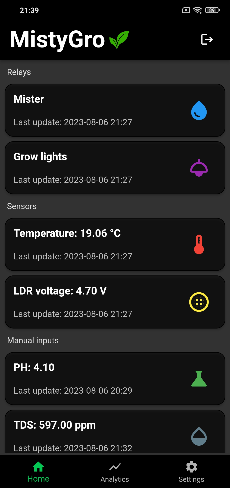
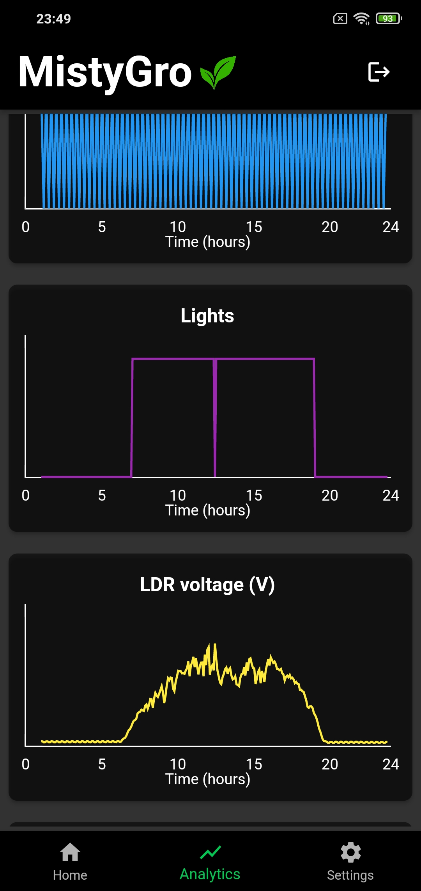

# App

  
  
  

- The app shows current state of the relays, sensors and allows recording manual inputs on the main page
- The analytics page shows the history of the relays, sensors and manual inputs for the duration of 24 hours.
- Click and holding on the graph reads the actual value at that time.

## Recording pH and total dissolved solids (TDS)

1. Click on the pH or TDS card > This will open up a dialog.
2. Measure the pH or TDS and add into the dialog and then click save.
