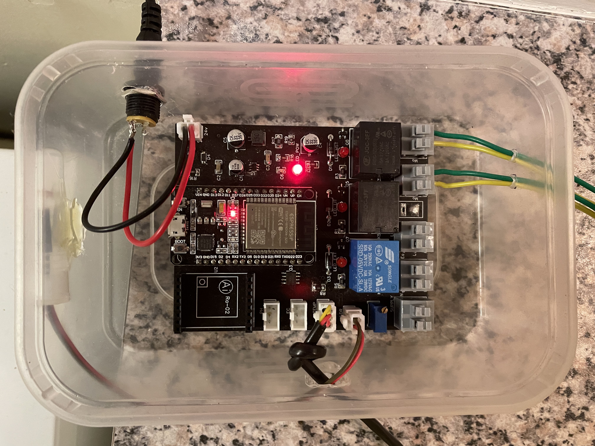
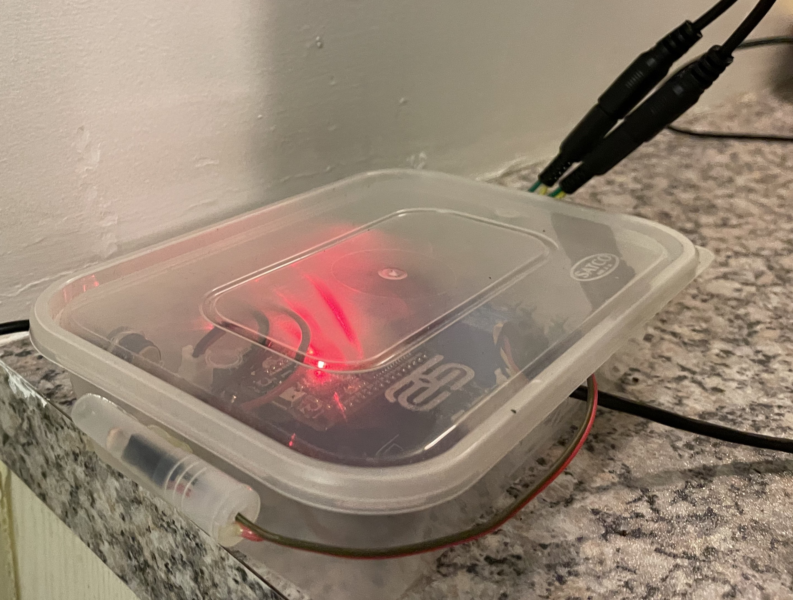

# Electronics enclosure design

The enclosure was made from

- Takeaway container (comes with an easy access lid ;) )
- Covid test, test tube for the LDR casing (great for diffusing light)

## Steps

1. Holes were drilled for power input, temperature sensor input, LDR input, light relay outputs and mister outputs.
2. Connectors were crimped onto the wires, routed through the enclosure and connected to the PCB.
3. The mister outputs from the PCB are connected to a 5.5 x 2.5mm male barrel jacks. These plug into the mister female barrel jack sockets.

