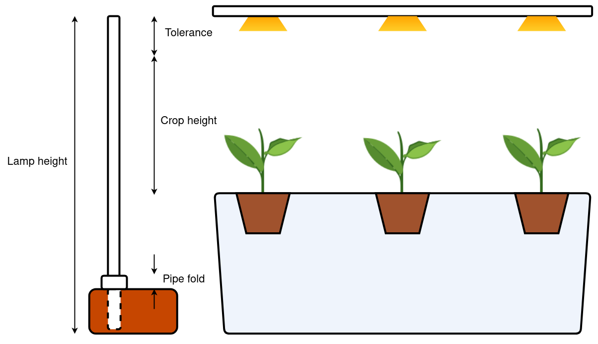
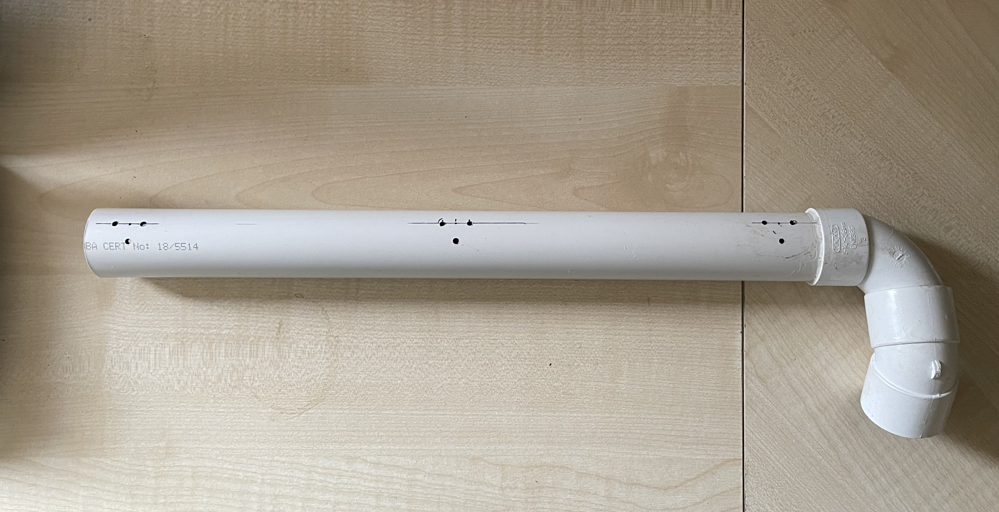
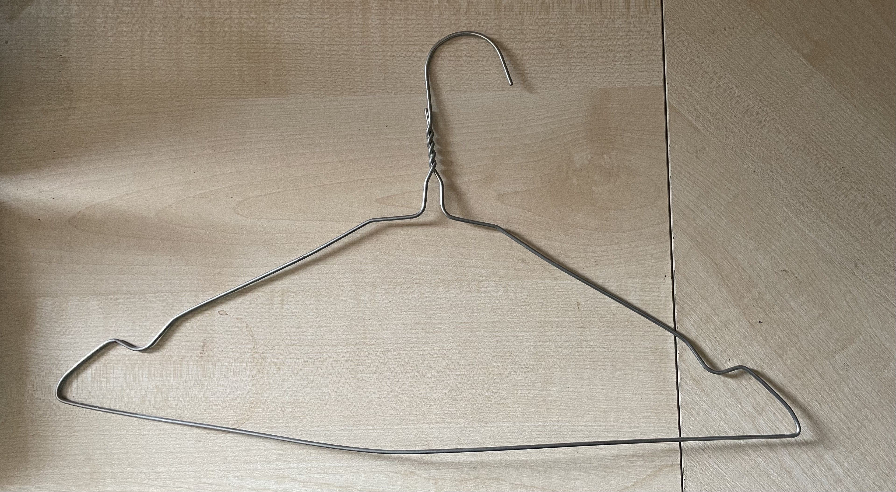
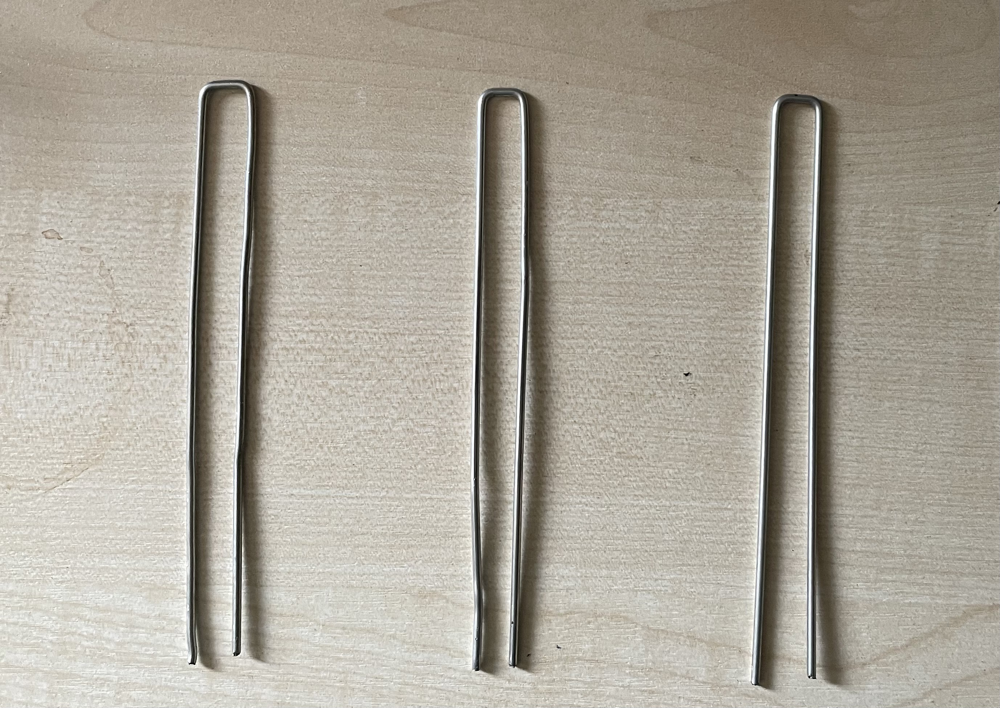
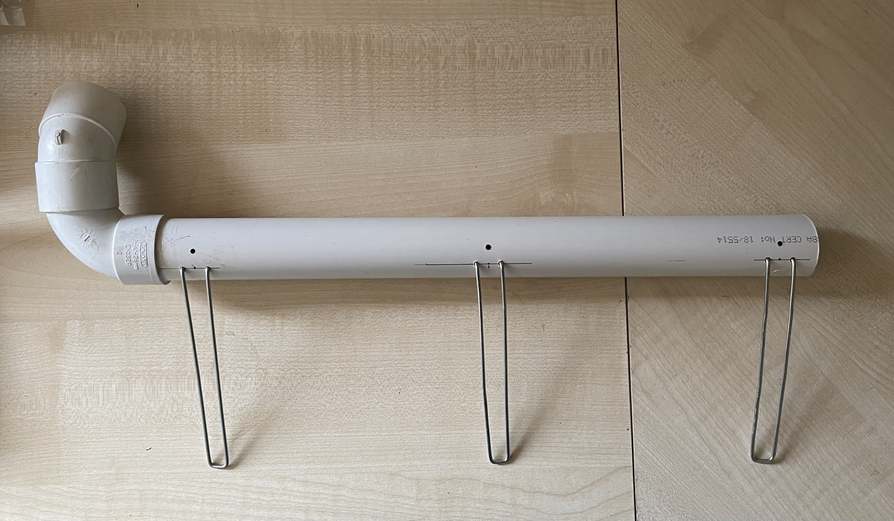
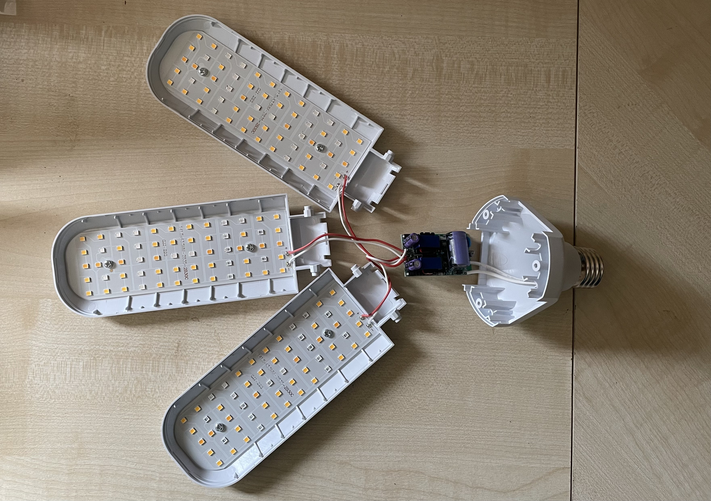
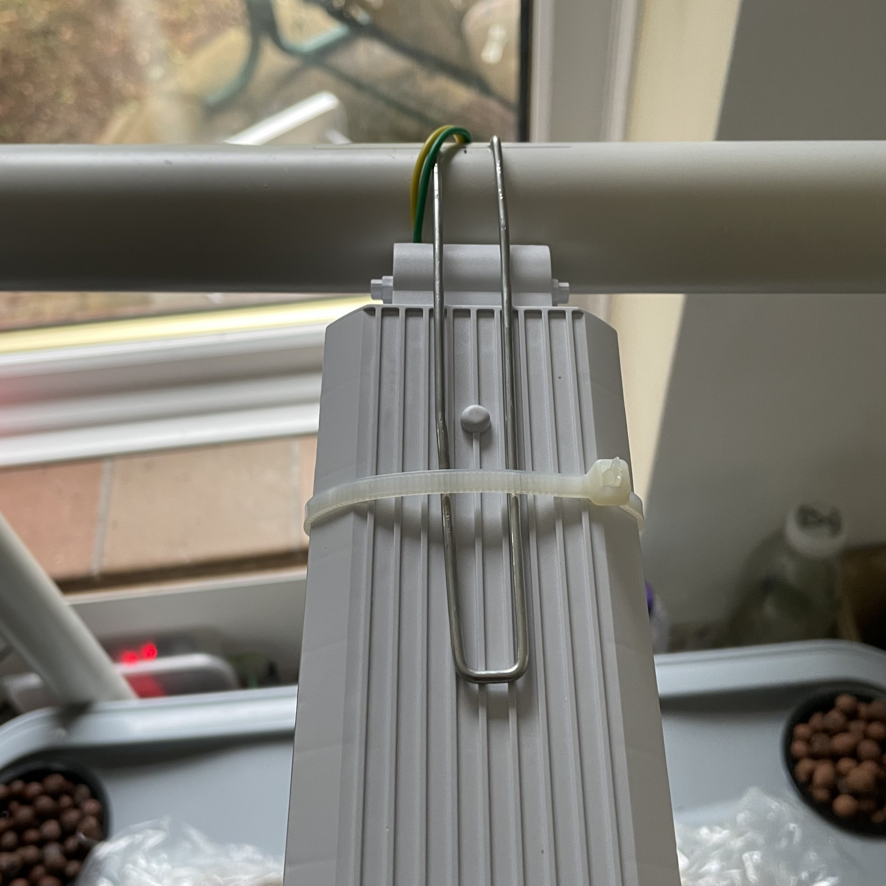
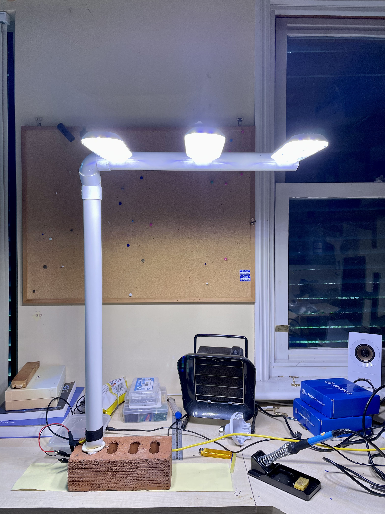
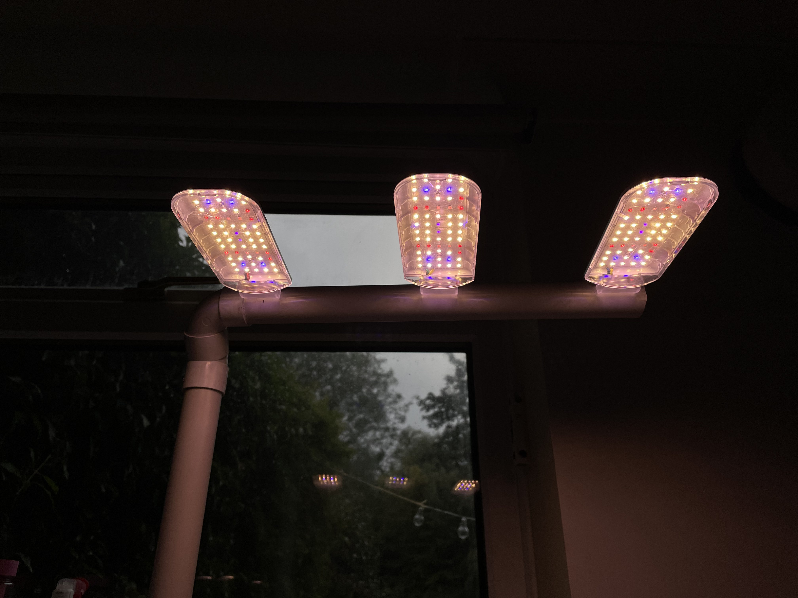

# Lamp design

The lamp was designed using

- A brick for the base
- Piece of waste pipe from a plumbing job which had an elbow joint 
- Clothes hanger
- Zip ties

## Steps

1. The height of the pipe was measured such that its atleast the maximum height of the crop when harvesting with some tolerance for light and a fold at the base of the pipe.
2. The about 20cm of pipe was heated to soften it and inserted into the brick with a fold that helps stabilising the lamp. The pipe was held vertical till hardened.

3. The overhead pipe was measured to hold the 3 units of lamp and holes (of hanger wire dia) were drilled using a soldering iron (makes them smooth tbh).

4. A hanger was cut and reshaped to make mounts for the lights as below.

5. The hanger mounts were then placed into the holes.

6. The grow lamp was dismantled and rewired to match required lengths and to fit a power plug at the end.

7. The light units are then mounted as shown below using zip ties to the hanger mounts. The wire is then routed through a third hole into the pipe.

8. Finally join the elbow and mount the overhead pipe to the vertical lamp stand.

