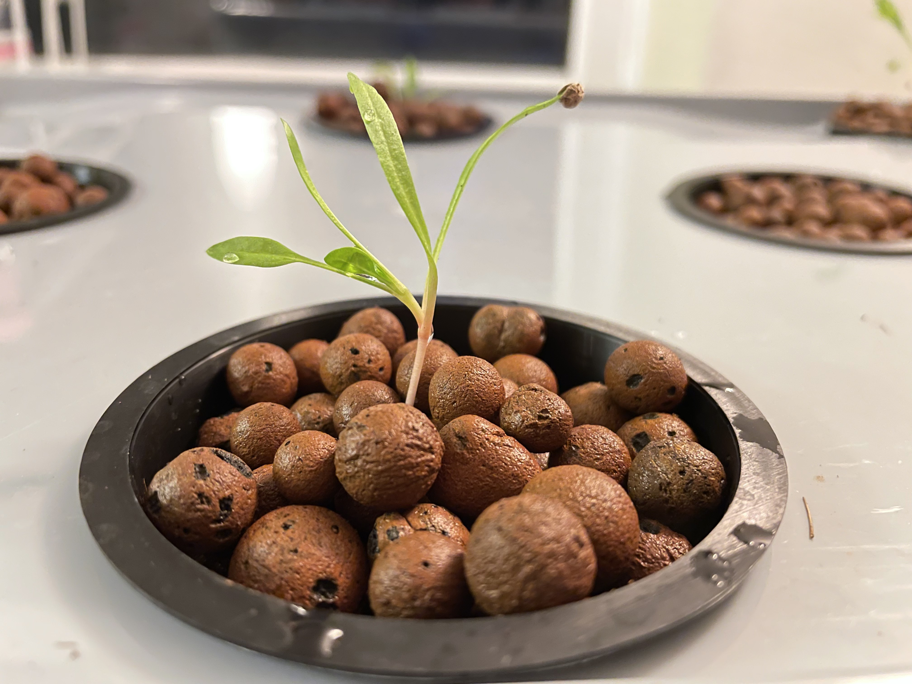
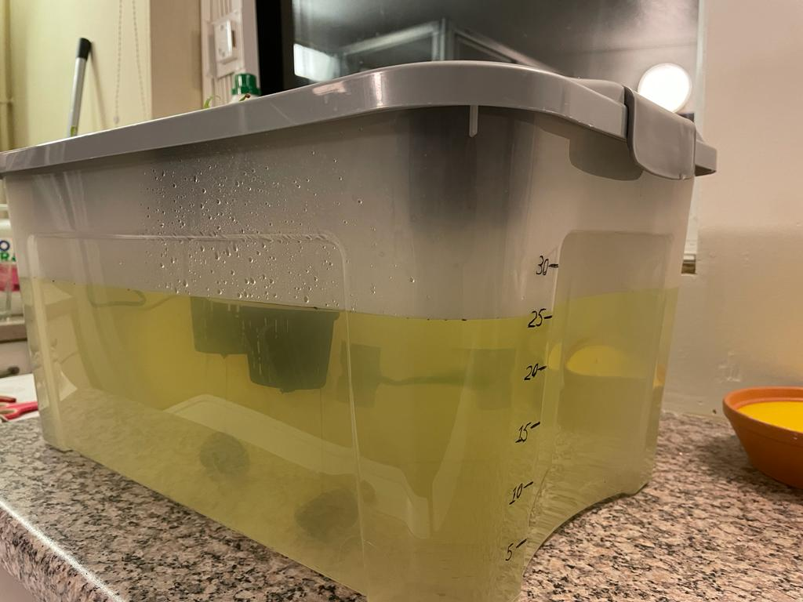
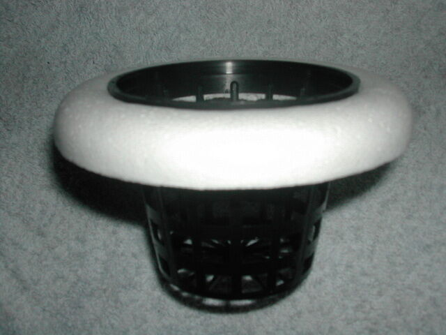

# Reservoir design

## Requirements

- [Storage box (food safe plastic)](https://www.wilko.com/en-uk/wilko-45l-modular-storage-box-with-lid/p/0449324)
- [Net pots]()
- Misters
- Mister floats
- Weights for misters

## Steps

1. 8 holes were cut from the lid such that they are well spread across the top.
2. The holes were cut using a soldering iron (with a sharp tip) as I don't have a drill. This was fairly easy too at 300 degree celsius and smoothens the edges, the flaws on the edges were also hidden by the lips of the netpots.

3. The reservoir was then calibrated for volume as this helped making the correct amount of nutrient mix without requiring another large vessel.

4. Mister floats were made using polystyrene pieces I had lying around from packaging. and netpots. I stole the idea from an [ebay product](https://www.ebay.co.uk/itm/324444872905?mkcid=16&mkevt=1&mkrid=711-127632-2357-0&ssspo=x7EEvAxJT_K&sssrc=2047675&ssuid=Eep4KVD9SkS&widget_ver=artemis&media=COPY) seen below.

