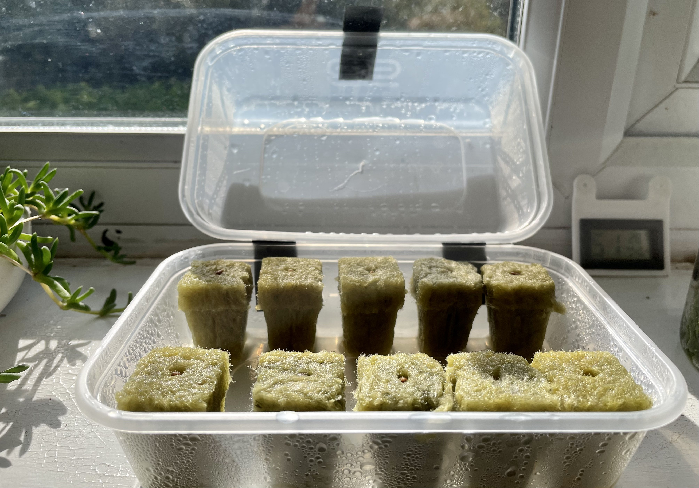

# Seedling start

## Requirements

- [Rockwool grow cubes](https://www.ebay.co.uk/itm/233722426889).
- Tray (2 takeaway containers do the job)
- [Nutrient solution](nutrient_solution.md).

## Steps

1. Seedlings were started in 25mm rockwool cubes purchased from [here](https://www.ebay.co.uk/itm/233722426889)
2. A seed was planted in each cube and the cubes were soaked in nutrient solution.
3. The cubes were then placed in a transparent container near a sunny window (can be placed under grow lights).
4. After the first true leaves sprout the seedlings are ready to be transferred to the net pots and placed on the grow chamber.

