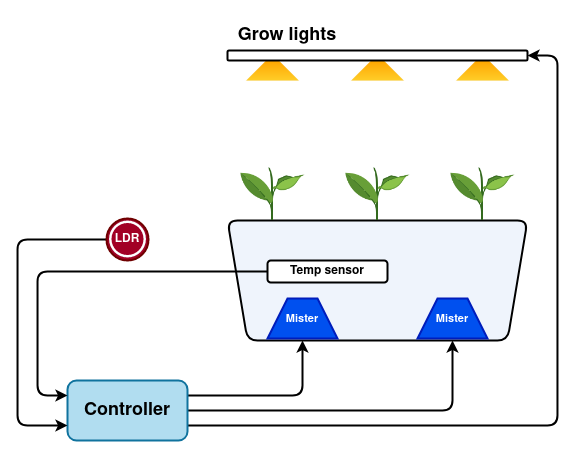

# MistyGro

A portable aeroponics planter/lab to monitor and study crop growth and yeild.

## API documentation

C++ API documentation in arduino platform for the ESP32 controller can be found [here](https://mro47.github.io/MistyGro/annotated.html)

## Navigating this repository

**BOM:** Bill of materials

**Circuit:** Circuit designs made using [Easy EDA](https://easyeda.com/). This should have the schematic as PDF, Easy EDA project file as json and the PCB zip.

**Docs:** Any documents or manuals ralated to this project.

**Images:** Any images related to this project.

**Software:** For controls and reading sensor data from hardware.

## System Architecture



The system hardware consists of

### Sensors

* Temperature sensor [DS18B20](https://www.adafruit.com/product/381), which is connected via an I2C interface.
* Electrical conductivity [(EC) meter](https://wiki.keyestudio.com/KS0429_keyestudio_TDS_Meter_V1.0) which is used to measure the total dissolved salts (TDS)
* [pH sensor](https://wiki.seeedstudio.com/Grove-PH-Sensor-kit/).
* [Photoresistor](https://www.adafruit.com/product/161)

### Actuators

The actuators are each controlled by relays and an extra relay is provided to add any control/actuation in the future.

* 2 x [Ultrasonic misters](https://uk.banggood.com/DC-24V-3528mm-Ultrasonic-Atomizer-Air-Humidifier-p-1067948.html?utm_source=googleshopping&utm_medium=cpc_organic&gmcCountry=GB&utm_content=minha&utm_campaign=minha-gbg-en-pc&currency=GBP&cur_warehouse=CN&createTmp=1&utm_source=googleshopping&utm_medium=cpc_us&utm_campaign=jeff-co-pmax-ukbg-allcat-uk-220412&utm_content=jeff&ad_id=)
these create the nutrient mist to supply nutrients to the plant roots.
* [Grow light](https://www.ebay.co.uk/itm/373804660515?hash=item57087e7723:g:W34AAOSwSS1iWTkR&var=642841957712)
These are made of LED panels, enclosure and drivers, so these could be hacked to control brightness or spectrum.

### Controls / Communication

* [ESP 32](https://www.amazon.co.uk/ESP-32S-Development-2-4GHz-Bluetooth-Antenna/dp/B071JR9WS9/ref=asc_df_B071JR9WS9/?tag=googshopuk-21&linkCode=df0&hvadid=310802245808&hvpos=&hvnetw=g&hvrand=11717239195705271296&hvpone=&hvptwo=&hvqmt=&hvdev=c&hvdvcmdl=&hvlocint=&hvlocphy=9046111&hvtargid=pla-402758208642&psc=1) controller is used which can be programmed through its usb micro connector.
* [LoRa RA-02](https://uk.banggood.com/433MHZ-SX1278-LoRa-Module-433M-10KM-Ra-02-Wireless-Spread-Spectrum-Transmission-Board-2_4G-IPX-Antenna-for-Smart-Home-p-1939044.html?utm_source=googleshopping&utm_medium=cpc_organic&gmcCountry=GB&utm_content=minha&utm_campaign=minha-gbg-en-pc&currency=GBP&cur_warehouse=CN&createTmp=1&utm_source=googleshopping&utm_medium=cpc_us&utm_campaign=jeff-co-pmax-ukbg-allcat-uk-220412&utm_content=jeff&ad_id=)
module mount is provided which has connections to the ESP 32. This chip can be used for long range radio communications.

## Setting up secrets

### For the Esp32

* Syncing timer with NTC will require WiFi credentials which can be set up following the instructions below.
* Firebase logging will also require firebase credentials. Which can be set up using [this](https://randomnerdtutorials.com/esp32-data-logging-firebase-realtime-database/) article from Random Nerd tutorials.
* Add a `secrets.h` file in `Software/ESP32/include` and fill in the details.

```cpp
#ifndef _SECRETS_H_
#define _SECRETS_H_

#define WIFI_SSID ""
#define WIFI_PASSWORD ""
#define FIREBASE_TOKEN ""
#define FIREBASE_USER_EMAIL ""
#define FIREBASE_USER_PASSWORD ""
#define FIREBASE_URL ""

#endif
```

## For the phone

* Follow [this](https://firebase.google.com/docs/flutter/setup?platform=android) to register the android app. Switch to IOS if you have to set this up on IOS device.

>****NOTE**** This project has been only tested with an android app and I'm (MRo47) a noob at flutter or in general app development. So contributions are welcome here.

## Install

* **Build the project in Platform.io:**
Currently the main file is selected in platformio.ini (commented out in the build_src_filter)
* **Upload to ESP32:**
Upload by clicking the upload button while press and holding the boot button on ESP32.
* **Test modules individually:**
Uncomment the `-<main.cpp>` line and comment out the test cpps for each module, one at a time. Then do step 1 and 2
