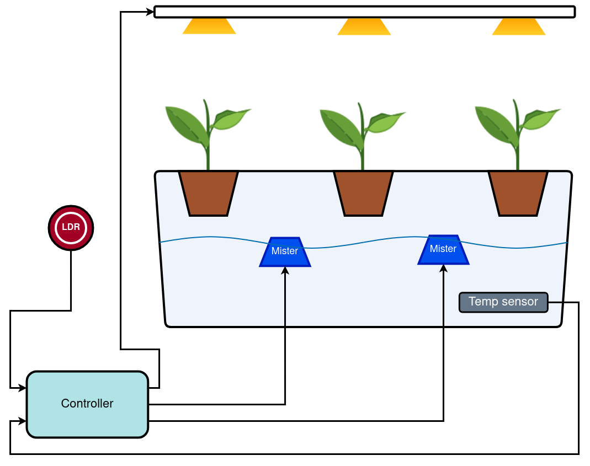

# MistyGro

An aeroponics/fogponics planter to monitor and study crop growth and yeild. Has a Flutter based app to monitor daily stats.

- Made to be hacked
- Open source hardware and software with docs

## API documentation

C++ API documentation in arduino platform for the ESP32 controller can be found [here](https://mro47.github.io/MistyGro/annotated.html)

## Where stuff lives

**BOM:** Bill of materials for hardware.

**Circuit:** Circuit designs made using [Easy EDA](https://easyeda.com/). This should have the schematic as PDF, Easy EDA project file as json and the PCB zip.

**Docs:** Any literature or manuals related to this project.

**Images:** Any images related to this project.

**Software:** For controls and reading sensor data from hardware.
  - **app:** MistyGro App designed in Flutter.
  - **ESP32:** Controller code based on arduino framework.

## System Architecture

System hardware diagram

The system hardware consists of

## Sensors

### Photoresistor (LDR)

A photoresistor is used to measure ambient light which is then used to control the grow lights.

- In sunny conditions the grow lights will be switched off.
- No better source of light than the sun?

### Temperature sensor

A temperature sensor [DS18B20](https://www.adafruit.com/product/381) is used to measure the temperature of the nutrient reservoir or can also be used to measure ambient temperatures in case if that provides any insight into growth factors of any crop.

### EC and pH sensors (manual)

- The old design for this project included a [EC (Electrical conductivity) sensor]((https://wiki.keyestudio.com/KS0429_keyestudio_TDS_Meter_V1.0)) and  [pH sensor](https://wiki.seeedstudio.com/Grove-PH-Sensor-kit/) which are not part of the project anymore.
  - Long term submersion of the EC meter with exposed metal electrodes would affect its accuracy as it could corrode in a salt solution
  - Similarly for the pH sensor the glass electrode would leach ions across the barrier and be useless for measuring pH.
- These properties are now externally measured by using ph and ec meters which can be cheaply obtained from [amazon](https://amzn.eu/d/4d1FXgC) or elsewhere and don't need a complex calibration routine.
- The app has provisions to log this data to firebase (recommend at-least 1 reading everyday for both properties)

EC and ph meters to manually read solution properties.

## Communication

### ESP32 WiFi

- Currently wifi is being used to log data and debug info to Firebase real time database (RTDB).

### LoRa module (unused)

- A LoRa interface is available on the PCB and can be used to log data over a long range incase the WiFi is unreachable in your den ;-).
  - Currently its unused so feel free to skip if you have a good wifi connection in you den.
  - The API needs to be designed too.

## Actuators

All devices are controlled via 5v relays.

### Ultrasonic misters

2 x [Ultrasonic misters](https://amzn.eu/d/a5XIISg) are used to atomize the nutrient solution.

Ultrasonic mister

### Grow lights

[Grow lights](https://amzn.eu/d/02rRoom) are wired up via relay and are switched on for a fixed time cycle from the ESP32 controller. Keeping the planter near a well lit window will switch off the lights when it gets bright (This can be set manually using the LDR voltage threshold).

The grow lamp was modified to a different configuration best suited for the planter.

original grow lamp

## Design

Most of the system is designed from available parts in and around my house, I believe in up-cycling too. This could be improved for replicability with proper CAD designs and 3D printed mounts (not my forte, contributions welcome).

Each part design can be found in the links to documents below.

- ### [Light](Docs/light_design.md)

- ### [Reservoir](Docs/reservoir_design.md)

- ### [Enclosure](Docs/enclosure_design.md)

## Installation and use

Instructions in [Docs/install.md](Docs/install.md)

## Contributing

Check issues page on [github](https://github.com/MRo47/MistyGro/issues) for things that need to be developed/fixed and open PRs.
